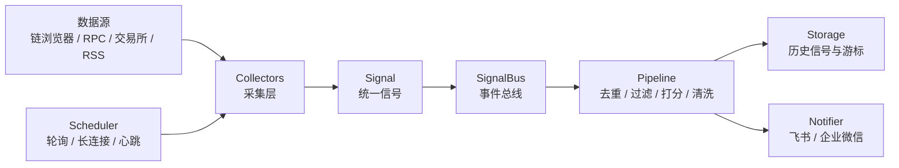

# 让 AI 实现链上监控小工具

这段时间做了一个小工具，用来把链上和交易市场里比较值得注意的变化抓出来，然后推送到群里。

从去年1011后，我更加意识到了信息时效的重要性，包括Vida复盘也提到了自己的监控系统。于是搭建一套服务自己的监控系统的想法开始出现，但受限于技术能力，实现的功能一直比较基础且不能达到预期。

比如一笔比较大的转账、某个合约事件、资金费率突然变得很极端，或者稳定币价格开始偏离锚定。这些东西单独看都不复杂，麻烦的是它们分散在很多地方。靠自己刷，容易漏；全部订阅，又会被一堆无关消息淹没。

后来我给这个工具定了一个很简单的标准：它不需要把所有消息都搬到我面前，只在有明显变化时提醒一下。大部分时间它应该是安静的，等真的出现大额转账、合约事件或者价格偏离，再把关键字段和原始链接发出来。

和 AI 沟通时，我后来基本按一个固定流程来提需求：先讲目标，再讲边界，然后讲数据怎么流动，最后才让它落到具体实现。

我的提需求框架大概是这样：

1. 先说我要解决什么问题：比如我不想一直刷区块浏览器，只想在有明显变化时收到提醒。
2. 再说这个工具不做什么：它不做交易建议，不存真实密钥，不把所有市场消息都推出来。
3. 接着让 AI 先设计程序结构：需要哪些模块，每个模块负责什么，数据从哪里进来，最后怎么推送出去。
4. 框架定下来后，再拆每一类细节：触发条件是什么，重复消息怎么处理，首次启动要不要回放历史，接口失败时怎么兜底。
5. 最后再让它写代码、补测试和整理文档。

这样做有一个好处：AI 不会只围绕某个临时脚本发挥，而是一直在同一个结构里补东西。先定框架，再补细节；先确定边界，再写具体实现。后面加新数据源或者改推送逻辑时，也不会每次都推倒重来。

这篇文章记录一下我把它做出来的过程。具体地址、密钥和真实配置就不展开了，重点写当时怎么和 AI 一起拆需求、定结构，以及一步步把细节补起来。

## 先把需求说清楚

一开始我给 AI 的描述其实很粗：

> 我想监控链上的大额转账、聪明钱地址和一些合约事件，有异常时推送到群里。

这个需求听起来不难。让 AI 直接写，它也能很快写出几个脚本：调一下区块浏览器 API，拿到交易列表，再发到飞书或者企业微信。

但我很快意识到，如果只做成几个脚本，后面会很难维护。

比如第一次启动时，要不要把历史交易全推一遍？同一笔交易被多轮轮询看到时，怎么避免重复？不同数据源的字段都不一样，后面怎么统一展示？群里长时间没有消息时，到底是市场平静，还是服务已经挂了？

这些问题不先想清楚，代码写得越快，后面越容易乱。

后来我就按上面这个框架，把需求重新拆了一遍：

1. 我到底想看哪些信号。
2. 每类信号满足什么条件才值得推。
3. 不同来源的数据怎么整理成同一种格式。
4. 推送前怎么做去重、过滤和降噪。
5. 程序跑起来之后，怎么知道它还活着。

拆完之后，再让 AI 参与就顺很多了。它不再只是帮我补一段函数，而是可以围绕这些问题继续往下推进。

## 先约定一条消息长什么样

这个项目里我最早定下来的东西，是一个叫 `Signal` 的统一对象。

我当时的想法是，不管消息来自哪里，最后都先整理成同一种格式。这样后面去重、打分、推送都不用关心它原来是链上交易、交易所公告，还是某个合约事件。

一个 `Signal` 大概会包含这些字段：

- `source`：它从哪里来。
- `category`：大概属于哪一类。
- `kind`：具体是什么信号，比如大额转账、合约事件、资金费率异常。
- `title` 和 `summary`：推送时给人看的标题和摘要。
- `url`：原始链接，方便回去核对。
- `metadata`：金额、地址、区块、方向这些结构化字段。
- `score`：大概有多重要。
- `happened_at`：事件发生时间。

这个约定看起来很普通，但它帮我省了很多事。

后面每次想加新能力，我都会先问 AI：这个数据源最后应该产出什么样的 `Signal`？原始字段里哪些要保留，哪些只用来判断，哪些需要放到推送文案里？

只要这一步想清楚，后面的代码就不会太飘。每个采集器只负责把自己的原始数据整理成 `Signal`，剩下的事情交给同一条处理链路。

## 结构尽量简单一点

最后这个工具的结构其实不复杂：

我给每一层都留了比较清楚的边界。

Collector 只负责采集和转换。比如大额转账 collector 只关心一件事：这笔交易要不要变成一条 `whale_tx` 类型的 `Signal`。它不直接发消息，也不管飞书或者企业微信怎么渲染。

Pipeline 负责推送前的处理，包括去重、过滤、打分和内容清洗。这样每个 collector 不用重复写一遍“这条消息能不能发”的判断。

Notifier 只负责把消息送出去。同一个 `Signal`，可以渲染成飞书的富文本，也可以渲染成企业微信的 Markdown。以后要换通道，也不用回头改采集逻辑。

Scheduler 负责让这些 collector 按节奏跑起来。有些数据源适合定时轮询，有些适合长连接。即使这一轮没有任何消息触发，也会定期打一条心跳日志。这样我至少能知道：没有消息不一定是程序挂了，可能只是确实没什么值得提醒。

这个结构没有什么新奇的地方，但对我很实用。尤其是和 AI 一起改代码时，边界越清楚，它越不容易把东西写串。

## 真正麻烦的是细节

链上数据都是公开的，但公开不代表好处理。真要做成一个能一直跑的小工具，会碰到很多细节。

第一个是首次启动。

如果直接从历史交易开始扫，第一次运行可能会把旧消息全推一遍。这种体验很差。我后来采用的方式是，第一次只初始化游标，从最新区块附近开始看，之后只处理新增内容。

第二个是金额单位。

链上的原始金额经常不是人能直接看的数字。ETH 有 wei，代币合约里也常常是原始整数。最后推到群里的时候，我真正想看的不是一长串整数，而是“转了多少 ETH / USDT，大概多少美元”。所以金额换算要尽早做掉，不然到后面打分和展示都会变得别扭。

第三个是价格。

只看 token 数量也不够。100 万个不知名代币和 100 万 USDT 完全不是一个概念。稳定币可以按 1 美元处理，其他代币就要查价格，而且还要做缓存。不然每看到一笔交易就查一次价格服务，很快就会慢下来，也容易碰到限制。

第四个是重复。

轮询类监控最容易遇到重复问题。同一笔交易可能被下一轮又扫到，同一个合约事件在服务重启后也可能重新出现。所以每条消息必须有稳定的 ID。大额转账可以用交易哈希，合约事件还要加上 log index，因为同一笔交易里可能有多条事件。

第五个是外部服务不稳定。

RPC 会超时，链浏览器 API 会限流，价格接口也可能失败。这个工具不能因为一次请求失败就停掉。更合理的处理是：这一轮失败就记录日志，下一轮继续；重要的数据源再准备多个 RPC 地址做备用。

这些地方很适合让 AI 帮忙做检查。我会把实现方案丢给它，让它从“会不会重复推”“会不会刷屏”“失败后会不会停摆”的角度挑问题。它不一定每次都说得对，但经常能提醒我补上没想到的边角。

## 少推比多推更难

刚开始做监控时，很容易什么都想接上，什么都想发出来。因为每多接一个数据源，都会觉得系统更完整一点。

但真跑起来之后，我发现更难的是让它少发。

群消息一多，人很快就不会看了。尤其是市场数据，本来噪音就多，如果每个小波动都提醒，最后真正重要的变化也会被淹没。

所以我给这个工具加了很多看起来“不产出内容”的东西：阈值、分数、黑名单、冷却时间、去重窗口、合规清洗。

比如大额转账会按美元价值打分，金额越大分数越高，但不会简单线性增长。资金费率这种信号需要冷却，不然同一个币种在极端状态下会反复提醒。强平、急跌、脱锚这类词也要注意表达方式，群机器人有内容审核，推送文案尽量保持中性。

我不希望这个工具告诉我应该怎么交易。它只需要把变化讲清楚：

- 为什么这条消息被推出来。
- 触发条件是什么。
- 金额、方向、时间这些关键字段是什么。
- 原始链接在哪里。
- 这是不是同一个事件的重复提醒。

剩下的判断还是要人自己做。

## AI 帮上忙的地方

这个项目里，AI 帮我最多的地方，不是一次把完整代码写出来，而是陪我把很多小问题一个个补上。

比如我想加一个新的合约事件监控时，我会先把想法说出来。AI 会帮我往下拆：配置应该怎么写，事件签名怎么描述，collector 最后应该输出什么 `Signal`，游标按什么维度保存，测试里要 mock 哪些返回。

很多时候我只想到主流程，它会顺手提醒异常情况：API key 没配怎么办，RPC 失败怎么办，时间戳用 UTC 还是本地时间，消息太长要不要截断，第一次启动要不要回放历史。

写测试时它也很顺手。因为这类系统依赖外部接口，测试里不能真的去请求链浏览器或者交易所。AI 可以帮我构造一些假的返回，把“原始数据变成 Signal，再变成推送文案”的链路跑起来。

还有文档。

这类工具如果只有代码，过一阵子自己都会忘：哪个 collector 开着，阈值是多少，为什么这么设，没消息时该怎么查，重启命令是什么。AI 很适合把这些东西整理成操作说明。文档一写清楚，后面改配置也没那么慌。

不过我也明显感觉到，有些事情不能交给 AI 决定。

比如一个信号到底有没有必要看，阈值设多高才合适，什么消息应该推到群里，什么消息应该忽略，这些都要靠我自己判断。AI 可以帮我实现、补漏、检查，但它不知道我真正想看的是什么。

## 做完之后的感觉

这个工具做下来，我对 AI 编程的感受比以前更具体了一点。

如果我只是说“帮我做一个链上监控”，AI 大概率会给我一个能跑的版本，但不一定好维护。它会很快写出代码，但也可能把采集、过滤、推送、配置混在一起。在使用过程中发现，如果想提高 AI 协作的效果，最好先给它一个比较清楚的框架：这部分只采集，这部分只处理，这部分只推送；真实配置不要写进代码；每次新增数据源都先想清楚 `Signal` 怎么定义；改完之后要有 dry-run、测试和文档。

这样用起来就顺很多。它不是临时帮我生成一个脚本，而是在一个清楚的框架里，继续帮我把项目往前推。

这个工具目前部署在个人飞书上，基本实现了我监控链上和交易所信息的需求。与预期相符的是，目前运行接近1个月，大部分时间都很安静，最近热门的TON和BTC上涨到8w美金会上报几次，在预期内。

做这个小工具也是我对AI预期的一个变化：以前更在意它能不能马上写出一段代码，现在更在意它能不能在一个清楚的结构里，帮我把细节一点点补齐。
