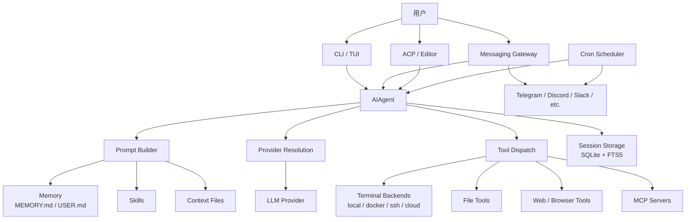

# Hermes Agent 调研：一个带学习闭环的云端个人 Agent

参考对象：[NousResearch/hermes-agent](https://github.com/NousResearch/hermes-agent) 及官方文档

## 概括

Hermes Agent 更像一个“可以长期运行在云端的个人 Agent 系统”，而不是单纯的命令行聊天工具。它把模型调用、终端工具、消息平台、长期记忆、技能沉淀、定时任务和多后端执行环境放到同一套框架里，从而让一个 Agent 可以跨会话、跨设备、跨任务持续工作。

如果只拿它和 Claude Code、Codex CLI 这类 coding agent 比，Hermes Agent 的重点会有些不一样。coding agent 通常围绕当前代码仓库工作；Hermes Agent 更强调“常驻、可被消息平台唤起、能记住经验、能定时执行任务、能把技能沉淀下来”。这使它更适合部署在云服务器上，作为一个随时可用的个人工作助手。

值得作为个人 AI 工作流的基础设施来试用，但不应该一开始就给它生产服务器的高权限。更稳妥的方式是先放在独立 VPS 或 Docker 隔离环境里，用 Telegram / Discord 这类入口处理低风险任务，再逐步扩展工具权限。

## 它解决的核心问题

传统 AI 助手有三个断点。

第一个断点是会话断点。今天聊过的项目偏好、踩过的坑、常用命令，明天又要重新讲一遍。

第二个断点是设备断点。很多 coding agent 依赖本地电脑和当前 IDE，离开这台电脑就很难继续让它工作。

第三个断点是行动断点。普通聊天工具可以建议你怎么做，但真正读文件、跑命令、调接口、定时巡检、把结果发到群里，还需要外层系统补上。

Hermes Agent 的设计基本是围绕这三个断点展开：

- 用 `~/.hermes/memories/`、session 存储和技能系统解决跨会话经验沉淀。
- 用 gateway 把 Telegram、Discord、Slack 等消息平台接入，让用户不必一直守在本地终端。
- 用 terminal backend、tool registry、cron、MCP、subagent 等能力让 Agent 可以实际执行任务。

所以它的产品定位不是“一个更长上下文的聊天框”，而是“一个可以常驻并被多入口调用的 Agent 工作系统”。

## 主要能力拆解

### 1. 多模型接入

Hermes Agent 支持 Nous Portal、OpenRouter、OpenAI、Anthropic、Hugging Face、Kimi / Moonshot、MiniMax、NVIDIA NIM、DeepSeek、Gemini、DashScope、自定义 OpenAI-compatible endpoint 等多种模型或模型网关。

配置方式以 `hermes model` 为主，也可以通过 `~/.hermes/.env` 和 `~/.hermes/config.yaml` 手动配置。官方文档特别强调：Hermes 需要至少 64K token 上下文的模型，否则会拒绝启动，因为多步工具调用和长会话需要足够的工作记忆。

这个设计的好处是模型不被单一厂商锁死。实际部署时可以先选一个稳定的 API 提供商，比如 OpenRouter、OpenAI、Claude、Kimi 或自建 OpenAI-compatible endpoint，后面再考虑 fallback 和路由。

### 2. CLI 和 TUI

Hermes 有两种终端入口：

- `hermes`：经典 CLI。
- `hermes --tui`：更现代的 TUI。

它们共享 session、slash command 和配置。日常使用时，可以把它当成一个本地或云端终端里的 Agent。它能读写文件、执行命令、调用工具，并把结果继续带回上下文。

这部分更接近传统 coding agent，但 Hermes 并不只面向代码任务。它也可以做资料整理、定时巡检、脚本执行、文件处理、消息推送等通用任务。

### 3. Messaging Gateway

Gateway 是 Hermes Agent 很关键的一层。官方文档把它描述为一个单独的后台进程：它连接 Telegram、Discord、Slack、WhatsApp、Signal、Email、Home Assistant、Matrix、DingTalk、Feishu、Teams 等平台，接收消息后路由到 Hermes 的 Agent loop，再把回复发回原平台。

这让 Hermes 的使用方式从“打开终端后使用”变成“在常用聊天软件里随时喊它”。比如：

- 在 Telegram 私聊里让它查服务器状态。
- 在 Discord 频道里让它总结一个仓库。
- 让 cron 任务每天把结果发回固定 chat。
- 用 `/stop` 中断正在执行的任务。
- 用 `/model` 在消息平台里切换模型。

这也是我认为它适合云服务器部署的原因。Agent 常驻在云端，用户用手机或电脑通过消息平台触发它，比较接近“私人云端助手”的形态。

### 4. Memory

Hermes 的 memory 不是无限历史，而是两份有边界的文件：

- `MEMORY.md`：Agent 记住的环境事实、项目约定、踩坑经验。
- `USER.md`：用户画像、偏好、沟通风格。

这两个文件存放在 `~/.hermes/memories/`。每次新 session 启动时，当前 memory 会以快照形式注入 system prompt。这样做的优点是上下文稳定，缺点是当前 session 中刚写入的 memory 要到下一个 session 才会出现在系统提示里。

我比较喜欢这个克制的设计。很多“长期记忆”系统容易变成无限堆历史，最后上下文越来越脏。Hermes 选择有字符上限的 curated memory，更像一本薄工作笔记，而不是完整聊天录像。

### 5. Skills

Hermes 的 skill 是一种按需加载的知识文档。它遵循 progressive disclosure：平时只暴露技能名称和描述，真正需要时才加载完整 `SKILL.md`，必要时再加载 reference 文件。

这和我之前整理 Agent 概念时的判断是一致的：Skill 适合保存“特定场景下的可复用流程”，不适合把所有内容都塞进常驻规则里。

例如：

- 写 PR review 的流程。
- 执行某类数据分析的步骤。
- 做 Kubernetes 排障的 checklist。
- 定时抓取并总结某个信息源的方法。

Hermes 的特别之处在于，它不仅能安装和调用 skill，还强调从经验中创建 skill、在使用中改进 skill。这是它“学习闭环”的核心卖点。

### 6. Tools、Toolsets 和执行后端

从官方架构文档看，Hermes 内部有一个 tool registry，工具按 toolset 组织。终端工具又支持多种后端：

- local：直接在当前机器执行。
- docker：在长期运行的容器里执行。
- ssh：通过 SSH 在远程服务器执行。
- modal：云端 sandbox。
- daytona：托管 workspace。
- vercel_sandbox：Vercel Sandbox。
- singularity：面向 HPC / 共享机器的容器环境。

这层设计决定了 Hermes 可以跑在很多环境里。个人使用时，最容易理解的是三种模式：

- 本机 local：方便，但权限风险最高。
- 云服务器 local：适合常驻，但建议单独服务器或低权限用户。
- Docker backend：让 Agent 的命令执行尽量隔离在容器里。

如果把 Hermes 接到消息平台，终端工具权限就更敏感。因为手机上一句话可能触发远程命令，所以最好从 Docker backend 或低权限用户开始。

### 7. Cron 定时任务

Hermes 的 cron 不是普通 shell cron，而是“定时启动一个 Agent 任务”。它可以：

- 一次性或周期性执行自然语言任务。
- 把结果发回消息平台。
- 给某个定时任务绑定 skill。
- 指定工作目录，让任务在某个项目上下文里执行。
- 使用 no-agent mode 跑脚本并把 stdout 发送出去。

这使它适合做一些低风险的自动化：

- 每天早上总结某几个 RSS / GitHub issue / 交易数据。
- 定时检查服务器状态。
- 每周整理一个项目的 open PR。
- 给自己发提醒或日报。

但 cron 也需要谨慎。长期无人值守的 Agent 任务应该尽量只读，或者只在隔离环境里写入临时目录。

## 架构理解

可以把 Hermes Agent 理解成下面这套结构：

这里的核心不是某一个模型，而是 `AIAgent` 作为中枢，把 prompt 构造、模型选择、工具调度、session 存储、memory、skills 和 gateway 都串起来。

从这个角度看，Hermes Agent 的价值在外层系统。模型可以换，入口可以换，执行环境可以换，但 Agent loop、记忆、技能和工具边界是连续的。

## 和 Claude Code / Codex 类工具的区别

| 维度    | Hermes Agent                     | Claude Code / Codex 类 coding agent |
| ----- | -------------------------------- | ---------------------------------- |
| 主要入口  | CLI、TUI、Telegram、Discord、Slack 等 | CLI、IDE、代码仓库                       |
| 核心场景  | 常驻个人助手、远程执行、自动化、消息平台交互           | 代码理解、修改、测试、PR 工作流                  |
| 记忆与技能 | 强调跨会话 memory 和 skill 自我沉淀        | 通常更依赖项目规则、当前上下文和会话历史               |
| 部署形态  | 本机、VPS、Docker、SSH、云 sandbox      | 通常在本机或开发环境中使用                      |
| 自动化   | 内置 cron，可把结果投递到平台                | 通常需要外部调度系统配合                       |
| 风险重点  | 长期常驻、消息入口、远程命令、密钥和权限             | 仓库改动、命令执行、代码质量和测试                  |

这两类工具不是替代关系。更自然的组合可能是：

- Hermes Agent 负责常驻入口、定时任务、资料整理、远程触发。
- 专门的 coding agent 负责高强度代码修改和本地项目工程化验证。

如果 Hermes 接入了代码仓库和终端工具，它也可以做 coding agent 的工作；但从产品气质看，它的独特点更在“常驻”和“学习闭环”。

## 适合的使用场景

优先考虑这些场景：

1. 个人云端助手

部署在独立 VPS 上，通过 Telegram / Discord 触发，用来做资料查询、脚本运行、轻量文件处理、服务器巡检。

1. 周期性信息整理

把 RSS、GitHub、链上数据、日志摘要、交易所公告等信息整理成日报或周报，再投递到指定聊天窗口。

1. 个人知识和流程沉淀

把常用工作流程写成 skill，让 Agent 在需要时加载，而不是每次重新解释。

1. 远程开发辅助

通过 SSH 或 Docker backend 让 Hermes 在云服务器上执行命令，用于远程项目维护、测试、日志查看。

1. 多平台消息助理

团队或个人在 Telegram / Discord / Slack 中统一调用同一个 Agent，并用 allowlist 控制谁可以使用。

## 暂时不适合的场景

1. 直接管理生产服务器

除非已经做好隔离、审批、日志和回滚，否则不要让 Agent 直接在生产机器上拥有高权限。

1. 高敏感数据环境

如果任务涉及交易密钥、用户隐私、未公开财务数据，需要先确认模型提供商、日志、memory、消息平台和备份策略都符合要求。

1. 完全无人值守的高风险自动化

比如自动改配置、自动部署、自动下单、自动删除文件。即使有 command approval，也不应该把系统安全完全交给模型判断。

1. 小上下文模型

Hermes 官方要求模型至少 64K 上下文。小上下文模型即使能接上，也不适合多轮工具调用和长任务。

## 风险点

### 1. 权限风险

Agent 能执行命令，就一定有误操作风险。尤其是 gateway 接入后，消息平台里的一句话可能触发服务器命令。

建议：

- 不用 root 跑 Hermes。
- 给 Hermes 单独系统用户。
- 优先使用 Docker terminal backend。
- `approvals.mode` 保持默认 manual 或 smart，不要长期使用 off / yolo。
- 高风险命令只在人工 SSH 到服务器后执行。

### 2. 密钥风险

Hermes 把 API key、bot token 等秘密放在 `~/.hermes/.env`，普通配置放在 `~/.hermes/config.yaml`。这个分层是合理的，但运维时要注意：

- `.env` 权限设置为 `600`。
- 备份时加密。
- 不把 `~/.hermes/` 直接提交到公开仓库。
- bot token 泄露后立即吊销。

### 3. 消息平台入口风险

Telegram / Discord bot 必须做 allowlist。否则任何能接触到 bot 的人都可能调用 Agent。

建议：

- 配置 `TELEGRAM_ALLOWED_USERS` 或 `DISCORD_ALLOWED_USERS`。
- 群聊里默认要求 mention。
- 不在公开群里开放完整工具权限。
- 为 cron 输出设置固定 home channel，避免误发。

### 4. 依赖和安装脚本风险

官方推荐一行 `curl | bash` 安装，方便但也意味着你信任远程脚本。个人测试可以接受；更严肃的服务器建议先下载脚本审查，或者 clone 固定 commit 后安装。

### 5. 成本风险

Hermes 支持长上下文、多轮工具调用、cron 和 background task。用强模型跑长任务时，token 成本可能不低。建议先限制任务范围，并定期看 `/usage` 或 provider 后台账单。

## 试点评估清单

如果要试用 Hermes Agent，建议按这个顺序验证：

1. 基础安装：`hermes doctor` 没有关键错误。
2. 模型可用：`hermes model` 配好 provider，普通聊天稳定返回。
3. 工具可用：能读当前目录、执行低风险命令、写临时文件。
4. session 可恢复：`hermes --continue` 能回到上一轮。
5. Docker 隔离：terminal backend 切到 docker 后，命令确实在容器中执行。
6. Telegram / Discord 接入：allowlist 生效，非授权用户不能调用。
7. gateway 服务化：重启服务器后 gateway 自动恢复。
8. cron 投递：定时任务能按计划执行，并投递到正确 chat。
9. memory 行为：它能记住有价值的长期偏好，但不会乱写敏感信息。
10. 日志和备份：知道日志在哪里，知道怎么备份和恢复 `~/.hermes/`。

## 理解

Hermes Agent 的方向比较有意思。它把很多 Agent 系统里容易分散的东西放到了一起：入口、模型、工具、记忆、技能、调度、消息投递、安全审批。对个人用户来说，这比自己从零搭一个 gateway + cron + bot + memory 系统省很多时间。

但因为它把这么多能力集中在一起，早期部署时要克制。不要一开始就追求“全自动”。按顺序先让它做三类事：

- 低风险信息整理。
- 可回滚的文件和脚本任务。
- 需要人工确认的远程运维辅助。

等到工具边界、日志、权限、备份都跑顺之后，再考虑更主动的自动化。

## 参考资料

- [Hermes Agent GitHub README](https://github.com/NousResearch/hermes-agent)
- [Hermes Agent 官方文档](https://hermes-agent.nousresearch.com/docs/)
- [Quickstart](https://hermes-agent.nousresearch.com/docs/getting-started/quickstart)
- [Installation](https://hermes-agent.nousresearch.com/docs/getting-started/installation)
- [Configuration](https://hermes-agent.nousresearch.com/docs/user-guide/configuration)
- [Messaging Gateway](https://hermes-agent.nousresearch.com/docs/user-guide/messaging)
- [Security](https://hermes-agent.nousresearch.com/docs/user-guide/security)
- [Architecture](https://hermes-agent.nousresearch.com/docs/developer-guide/architecture)
- [Skills System](https://hermes-agent.nousresearch.com/docs/user-guide/features/skills)
- [Persistent Memory](https://hermes-agent.nousresearch.com/docs/user-guide/features/memory)
- [Scheduled Tasks](https://hermes-agent.nousresearch.com/docs/user-guide/features/cron)

