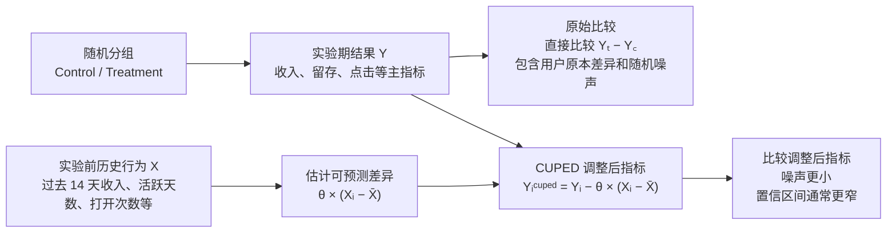

# 如何更快验证 A/B 实验效果：CUPED 理论与应用介绍

> 最后更新：2026-06-23

## 一、概览

CUPED（Controlled-experiment Using Pre-Experiment Data）是一种用于 A/B 实验的方差缩减方法。它利用用户在实验开始前的历史行为解释一部分天然差异，从而降低实验指标的噪声，让同样的样本量得到更窄的置信区间，或者在相同统计功效下缩短实验时间。

它不改变实验随机化逻辑，也不改变主指标含义；通过改变指标估计方式：把“实验前就能预测的用户差异”从实验期结果中扣除。

可以先用一张图理解 CUPED 在做什么：



图里的关键点是：随机分组仍然决定因果比较的基础；CUPED 只是额外利用实验前的历史行为，估计并扣除用户原本就可能存在的差异。

## 二、CUPED 解决什么问题

在线实验中，用户天然差异很大。以收入、使用时长、搜索次数、付费金额、活跃天数为例，很多用户即使没有任何实验影响，也会因为历史活跃度、付费习惯、地区、设备、生命周期阶段不同而产生很大波动。

传统 A/B 分析直接比较实验组和对照组的实验期均值：

```text
效果 = 实验组实验期指标均值 - 对照组实验期指标均值
```

如果指标本身噪声很大，实验需要更长时间才能判断差异是否可信。CUPED 的思路是：

```text
实验期结果 = 处理效应 + 用户原本差异 + 随机噪声
```

其中“用户原本差异”可以用实验前数据部分解释。扣除这部分可预测差异后，剩余噪声变小，实验敏感度提高。

### 1. CUPED 思想概述

可以先不讲公式，把 CUPED 概述为：

```text
比较实验效果时，不要只看用户实验后的表现，还要先考虑这个用户本来就是什么水平。
```

举个例子。假设我们要评估一个功能是否提升用户的消费金额。实验结束后看到：

```text
实验组平均消费 12 元
对照组平均消费 10 元
```

表面上看，实验组高了 2 元。但这里面可能混着两种东西：

1. 功能真的带来的提升。
2. 实验组里本来就有更多高消费用户。

随机分组理论上会让两组用户差不多，但现实中只要样本有限，两组仍然可能有一些随机差异。比如实验开始前，实验组用户过去 14 天平均消费本来就比对照组高一点。那实验结束后的差距里，就有一部分不是功能造成的，而是用户原本水平不同造成的。

CUPED 做的事情，就是先问一个问题：

```text
如果不看实验影响，只看这个用户过去的行为，我们大概能预测他实验期会表现成什么样？
```

如果一个用户实验前就很活跃、很爱付费，那他实验期大概率也会更活跃、更爱付费；如果一个用户实验前几乎不用产品，那他实验期表现低一些也很正常。这些差异不是实验造成的，而是用户自己的历史差异。

所以 CUPED 会把实验期结果拆成两部分：

```text
实验期结果 = 用户本来可能达到的水平 + 实验真正可能带来的变化 + 随机波动
```

普通 A/B 分析直接比较“实验期结果”。CUPED 则先扣掉“用户本来可能达到的水平”里能被历史行为解释的部分，再比较两组剩下的差异。

这就像考试后比较两个班的新教学方法有没有用。如果 A 班学生入学时基础本来就更好，直接比较期末平均分可能不公平。更合理的是看：

```text
期末成绩是否超过了根据入学成绩预期能达到的水平？
```

CUPED 在实验里做的就是类似的事：

```text
实验后表现是否超过了根据实验前表现预期能达到的水平？
```

这样做的好处不是“人为修正结果”，而是减少噪声。它没有改变我们要衡量的实验效果，只是把那些实验前就存在、而且和实验无关的用户差异先拿掉。剩下的比较会更干净，置信区间通常更窄，也就更容易用较短时间判断实验是否真的有效。

可以用三个关键词概括 CUPED 的理论思路：

| 关键词 | 含义 | 直白解释 |
| --- | --- | --- |
| 实验前变量 | 实验开始前已经确定的用户信息或行为 | 这个人在实验前本来是什么状态 |
| 可预测差异 | 历史行为能解释的一部分实验期表现 | 有些人本来就更活跃或更容易付费 |
| 方差缩减 | 扣掉可预测差异后，指标波动变小 | 背景噪声小了，实验信号更容易看清 |

需要特别强调的是，CUPED 只能使用实验发生前的数据。它不能用实验曝光后、功能触达后、用户已经受影响后的行为来调整，否则就可能把真实实验效果也一起扣掉。

## 三、核心理论

### 1. 基础设定

假设每个实验单位是用户。定义：

- $Y_i$：用户 $i$ 在实验期的目标指标，例如实验期收入、D7 留存、点击次数。
- $X_i$：用户 $i$ 在实验前的协变量，例如实验前 14 天收入、活跃天数、同口径历史指标。
- $T_i$：实验分组，$T_i = 1$ 表示实验组，$T_i = 0$ 表示对照组。

传统估计量是：

$$
\hat{\Delta}_{raw} = \bar{Y}_T - \bar{Y}_C
$$

CUPED 构造一个调整后的指标：

$$
Y_i^{cuped} = Y_i - \theta (X_i - \bar{X})
$$

其中：

- $\bar{X}$ 是协变量在实验样本中的总体均值。
- $\theta$ 是调整系数，用来控制扣除多少历史行为影响。

然后比较调整后指标的组间差异：

$$
\hat{\Delta}_{cuped} = \bar{Y}^{cuped}_T - \bar{Y}^{cuped}_C
$$

展开后：

$$
\hat{\Delta}_{cuped}
= (\bar{Y}_T - \bar{Y}_C) - \theta(\bar{X}_T - \bar{X}_C)
$$

由于实验是随机分组，实验组与对照组在实验前协变量上的期望差异为 0：

$$
E[\bar{X}_T - \bar{X}_C] = 0
$$

所以 CUPED 在随机实验下仍然是无偏估计：

$$
E[\hat{\Delta}_{cuped}] = E[\hat{\Delta}_{raw}]
$$

### 2. 最优调整系数

CUPED 的目标是让调整后指标 $Y_i^{cuped}$ 的方差最小。

$$
Var(Y - \theta X)
= Var(Y) + \theta^2 Var(X) - 2\theta Cov(Y, X)
$$

对 $\theta$ 求最小值，得到：

$$
\theta^* = \frac{Cov(Y, X)}{Var(X)}
$$

这与一元线性回归中 $Y$ 对 $X$ 的斜率一致。直观理解是：如果历史行为 $X$ 和实验期结果 $Y$ 高度相关，就应该扣除更多由 $X$ 解释的部分；如果相关性很低，CUPED 的收益就很有限。

### 3. 方差缩减幅度

当使用最优 $\theta^*$ 时，调整后方差为：

$$
Var(Y^{cuped}) = Var(Y)(1 - \rho^2)
$$

其中 $\rho$ 是 $X$ 与 $Y$ 的相关系数。

这意味着方差缩减比例约为：

$$
\rho^2
$$

示例：

| 历史协变量与实验期指标相关系数 | 理论方差缩减 | 样本量/实验时长需求约为原来的 |
| --- | ---: | ---: |
| 0.2 | 4% | 96% |
| 0.4 | 16% | 84% |
| 0.6 | 36% | 64% |
| 0.7 | 49% | 51% |

所以 CUPED 是否有效，关键取决于能否找到与实验期指标强相关、且不受实验影响的实验前协变量。

## 四、CUPED 与回归调整的关系

CUPED 可以理解为一种控制变量法，也可以看作 ANCOVA / regression adjustment 在在线实验中的轻量实现。

单协变量版本：

$$
Y_i^{cuped} = Y_i - \theta (X_i - \bar{X})
$$

多协变量版本：

$$
Y_i^{cuped} = Y_i - \boldsymbol{\theta}^\top(\boldsymbol{X_i} - \bar{\boldsymbol{X}})
$$

其中：

$$
\boldsymbol{\theta}^* = \Sigma_X^{-1} Cov(\boldsymbol{X}, Y)
$$

工程上可以直接通过 OLS 回归估计：

```text
Y ~ treatment + pre_period_metric + other_covariates
```

如果只关心 treatment 的系数，它与 CUPED 调整后再做组间比较在很多常见设定下是等价或近似等价的。

不过在实验平台中，CUPED 通常更容易产品化：先生成一个调整后指标，再复用已有的均值差、置信区间、p 值、序贯检验等分析流程。

## 五、适用场景

CUPED 特别适合以下实验：

| 场景 | 原因 |
| --- | --- |
| 成熟产品、老用户占比较高 | 用户有足够历史行为可用 |
| 指标跨周期稳定 | 历史行为能预测实验期行为 |
| 收入、使用时长、搜索次数、活跃天数等高方差指标 | 方差越大，潜在收益越明显 |
| 实验流量有限、希望缩短周期 | 方差缩减能提高统计功效 |
| 平台级实验分析体系 | 可作为默认方差缩减模块产品化 |

不太适合或收益有限的场景：

| 场景 | 原因 |
| --- | --- |
| 全新用户为主 | 缺少实验前数据 |
| 一次性行为指标 | 历史行为预测力弱 |
| 协变量与主指标相关性很低 | 方差缩减有限 |
| 实验改变了触达或进入样本的机制 | 需要特别处理触发样本与选择偏差 |
| 协变量可能被实验影响 | 会引入偏差，不能使用 |

## 六、协变量选择原则

### 1. 必须满足的条件

好的 CUPED 协变量需要满足：

1. 发生在实验处理之前。
2. 不会被实验策略、曝光、触发、推荐逻辑影响。
3. 与实验期目标指标有较高相关性。
4. 对实验组和对照组定义完全一致。
5. 覆盖率足够高，缺失机制可解释。

### 2. 常用协变量

优先级通常如下：

| 优先级 | 协变量 | 说明 |
| --- | --- | --- |
| 高 | 同指标的历史值 | 例如实验期收入用实验前收入做协变量 |
| 高 | 同指标的历史频次/强度 | 例如历史活跃天数、历史打开次数 |
| 中 | 相关漏斗前置行为 | 例如实验期付费用历史加购、访问、搜索行为预测 |
| 中 | 用户生命周期特征 | 新老用户、注册天数、历史活跃层级 |
| 中 | 稳定用户属性 | 国家、平台、设备、渠道等 |
| 低 | 与目标弱相关的宽泛属性 | 收益有限，且可能增加复杂度 |

经验上，“目标指标在实验前同口径历史值”往往是最强协变量。

### 3. 预实验窗口长度

预实验窗口不是越长越好。常见选择：

- 实验前 7 天：更贴近近期状态，适合高频指标。
- 实验前 14 天：覆盖更多用户，波动相对平滑。
- 实验前 28 天：适合低频指标或付费指标。

选择窗口时要平衡：

- 与实验期指标的相关性。
- 协变量覆盖率。
- 数据新鲜度。
- 业务周期性，例如周末效应、发薪日、活动日。

建议在历史 A/A 或历史实验上比较不同窗口的方差缩减效果，再确定默认窗口。

## 七、标准实施流程

### 1. 实验前设计

实验开始前应确定：

| 项目 | 说明 |
| --- | --- |
| 随机化单位 | 用户、设备、账号或店铺，必须与分析单位一致或可正确聚合 |
| 主指标 | CUPED 作用的目标指标 |
| Guardrail 指标 | 性能、留存、投诉、崩溃率、负反馈等 |
| 预实验窗口 | 例如实验开始前 14 天 |
| 协变量定义 | 字段、时间窗、过滤条件、缺失处理 |
| 是否对所有主指标默认启用 CUPED | 建议主指标默认启用，guardrail 根据指标性质决定 |
| 报告方式 | 同时报告 raw 与 CUPED 后结果 |

### 2. 数据准备

以用户级实验为例，需要构建用户粒度宽表：

| 字段 | 示例 |
| --- | --- |
| user_id | 用户 ID |
| variant | control / treatment |
| y | 实验期目标指标 |
| x | 实验前协变量 |
| triggered | 是否进入实验触发样本 |
| exposure_time | 首次曝光时间 |
| segment fields | 国家、平台、版本、渠道等 |

注意：如果实验采用触发分析，只分析真正触发实验逻辑的用户，那么协变量也必须发生在触发之前，避免把触发后的行为放进协变量。

### 3. 估计调整系数

一般使用实验样本中实验组和对照组的 pooled data 估计：

$$
\hat{\theta} = \frac{\widehat{Cov}(Y, X)}{\widehat{Var}(X)}
$$

然后计算：

$$
Y_i^{cuped} = Y_i - \hat{\theta}(X_i - \bar{X})
$$

实践中也可以用历史 A/A 数据或前期数据估计 $\theta$。如果担心过拟合，可以使用 cross-fitting：用一部分样本估计 $\theta$，另一部分样本计算调整后指标。

### 4. 计算效果与置信区间

计算调整后指标的均值：

$$
\bar{Y}^{cuped}_T,\quad \bar{Y}^{cuped}_C
$$

估计实验效果：

$$
\hat{\Delta}_{cuped} = \bar{Y}^{cuped}_T - \bar{Y}^{cuped}_C
$$

相对提升：

$$
Lift = \frac{\hat{\Delta}_{cuped}}{\bar{Y}^{cuped}_C}
$$

置信区间和 p 值可以沿用两样本 t-test、Welch t-test、bootstrap、cluster robust standard error 等方法，前提是与原实验分析的独立性、聚类和抽样假设一致。

## 八、BigQuery 风格 SQL 模板

下面是单协变量 CUPED 的简化模板。实际使用时需要替换表名、日期、实验 ID、指标口径和分区字段。

```sql
WITH assignment AS (
  SELECT
    user_id,
    variant,
    MIN(exposure_time) AS first_exposure_time
  FROM experiment_assignment
  WHERE experiment_id = 'exp_xxx'
    AND assignment_date BETWEEN '2026-06-01' AND '2026-06-14'
  GROUP BY user_id, variant
),

pre_period AS (
  SELECT
    user_id,
    SUM(metric_value) AS x_pre_metric
  FROM user_daily_metric
  WHERE dt BETWEEN '2026-05-18' AND '2026-05-31'
  GROUP BY user_id
),

experiment_period AS (
  SELECT
    user_id,
    SUM(metric_value) AS y_exp_metric
  FROM user_daily_metric
  WHERE dt BETWEEN '2026-06-01' AND '2026-06-14'
  GROUP BY user_id
),

base AS (
  SELECT
    a.user_id,
    a.variant,
    COALESCE(p.x_pre_metric, 0) AS x,
    COALESCE(e.y_exp_metric, 0) AS y
  FROM assignment a
  LEFT JOIN pre_period p USING (user_id)
  LEFT JOIN experiment_period e USING (user_id)
),

cuped_params AS (
  SELECT
    AVG(x) AS x_bar,
    SAFE_DIVIDE(COVAR_SAMP(y, x), VAR_SAMP(x)) AS theta
  FROM base
),

adjusted AS (
  SELECT
    b.user_id,
    b.variant,
    b.y,
    b.x,
    b.y - p.theta * (b.x - p.x_bar) AS y_cuped
  FROM base b
  CROSS JOIN cuped_params p
)

SELECT
  variant,
  COUNT(*) AS users,
  AVG(y) AS raw_mean,
  STDDEV_SAMP(y) AS raw_sd,
  AVG(y_cuped) AS cuped_mean,
  STDDEV_SAMP(y_cuped) AS cuped_sd
FROM adjusted
GROUP BY variant;
```

差异、标准误、置信区间和 p 值可以在 SQL 中继续计算，也可以把用户级调整后数据导出到 Python/R 中完成。

## 九、比率指标如何使用 CUPED

比率指标包括：

- ARPU = revenue / users
- CTR = clicks / impressions
- CVR = conversions / visitors
- Revenue per session = revenue / sessions

比率指标不能简单地对整体比率直接做 CUPED。推荐做法是先线性化，再对线性化后的用户级指标应用 CUPED。

假设指标为：

$$
R = \frac{\sum N_i}{\sum D_i}
$$

使用对照组或全局基线比率 $r_0$ 线性化：

$$
L_i = N_i - r_0 D_i
$$

然后对 $L_i$ 做 CUPED：

$$
L_i^{cuped} = L_i - \theta(X_i - \bar{X})
$$

最后比较实验组和对照组的 $L_i^{cuped}$ 均值差异。这个差异可以近似解释为原比率指标的变化方向与显著性。

如果实验平台已有 delta method、bootstrap 或 cluster robust 的比率指标标准误实现，应在同一统计框架下接入 CUPED，避免前后口径不一致。

## 十、缺失协变量处理

新用户或低活跃用户可能没有实验前数据。常见处理方式：

| 方法 | 做法 | 适用场景 |
| --- | --- | --- |
| 缺失填 0 | 没有历史行为视为 0 | 指标天然非负，0 有业务含义 |
| 缺失填均值 + missing indicator | $X$ 缺失填均值，再加是否缺失特征 | 缺失本身有预测意义 |
| 新老用户分层 | 老用户用 CUPED，新用户不用或单独估计 | 新老用户行为差异大 |
| 多协变量模型 | 同时使用历史行为、用户年龄、平台等 | 数据量充足，模型稳定 |

不要直接删除缺失协变量用户，除非实验分析目标本来就只覆盖有历史行为的老用户。否则会改变实验人群。

## 十一、质量验证与诊断

上线 CUPED 前，建议做以下验证。

### 1. A/A 测试验证

在没有真实处理效应的 A/A 实验中检查：

- CUPED 后 p 值是否仍然服从合理分布。
- false positive rate 是否接近设定的显著性水平。
- CUPED 是否改变了组间估计的无偏性。
- 方差缩减是否稳定。

### 2. 协变量平衡检查

检查实验组与对照组的实验前协变量是否平衡：

```text
mean_x_treatment - mean_x_control
```

随机实验中该差异期望为 0。小幅不平衡是随机波动；大幅不平衡可能意味着分流、埋点或样本构建有问题。

### 3. 方差缩减报告

每次实验报告中建议输出：

| 指标 | 含义 |
| --- | --- |
| raw_sd | 原始用户级指标标准差 |
| cuped_sd | CUPED 后用户级指标标准差 |
| variance_reduction | $1 - Var(Y^{cuped}) / Var(Y)$ |
| corr_x_y | 协变量与实验期指标相关系数 |
| theta | CUPED 调整系数 |
| covariate_coverage | 协变量覆盖率 |

### 4. 与原始结果并排展示

建议同时展示 raw 和 CUPED：

| 版本 | 对照组均值 | 实验组均值 | 绝对差异 | 相对提升 | p 值 | 置信区间 |
| --- | ---: | ---: | ---: | ---: | ---: | --- |
| Raw | ... | ... | ... | ... | ... | ... |
| CUPED | ... | ... | ... | ... | ... | ... |

如果 raw 与 CUPED 方向相反，需要重点排查：

- 协变量是否被实验影响。
- 样本是否触发后才纳入。
- 是否存在极端值。
- 随机化是否异常。
- $\theta$ 是否估计不稳定。

## 十二、常见风险和误区

### 1. 使用了实验后的变量

这是最严重的问题。CUPED 只能使用实验处理前的变量。如果用实验期行为、曝光后行为、触发后行为作为协变量，就可能把真实处理效应扣掉，甚至引入反向偏差。

### 2. 以为 CUPED 能修复坏随机化

CUPED 不能替代正确的随机分流、样本构建和埋点校验。如果随机化本身有问题，CUPED 最多降低噪声，不能让因果结论自动成立。

### 3. 只看显著性，不看效应大小

CUPED 会提高敏感度，可能让更小的差异显著。但业务决策仍然应基于效应大小、置信区间、成本、风险和 guardrail 指标。

### 4. 协变量越多越好

过多弱相关协变量可能让模型复杂、解释困难，并引入稳定性问题。建议从少量高质量协变量开始，优先使用同口径历史指标。

### 5. 对所有指标机械套用

不是每个指标都适合 CUPED。对低相关、低覆盖、强非稳定或极端稀疏指标，CUPED 收益可能很小，甚至让解释成本高于收益。

## 十三、与其他提效方法的关系

| 方法 | 作用 | 与 CUPED 的关系 |
| --- | --- | --- |
| 分层随机 | 在分流阶段提高组间平衡 | 可与 CUPED 叠加 |
| 触发分析 | 只分析真正受实验影响的人群 | 可叠加，但协变量必须在触发前 |
| 序贯检验 | 允许合法提前停止 | 可对 CUPED 后指标做序贯检验 |
| Bayesian 实验 | 用后验概率做决策 | 可使用 CUPED 后指标或协变量模型 |
| 指标线性化 | 处理比率指标 | 常作为 CUPED 前置步骤 |
| outlier trimming / winsorization | 降低极端值影响 | 可叠加，但规则应实验前固定 |

我们的目标是“更短时间评估实验效果”，可使用组合可以为：

```text
CUPED 降低方差
+ 序贯检验合法早停
+ 触发分析聚焦受影响人群
+ guardrail 指标防止局部优化
```

## 十四、推荐落地方案

### 1. 第一阶段：离线验证

目标：证明 CUPED 在历史数据上有效。

工作项：

1. 选 3-5 个高频主指标，例如活跃、收入、留存、核心行为次数。
2. 用历史 A/A 或历史实验重放。
3. 比较不同预实验窗口：7 天、14 天、28 天。
4. 输出每个指标的相关系数、方差缩减、覆盖率和 false positive 校验。
5. 确定默认协变量和窗口。

验收标准：

- 主指标有稳定正向方差缩减。
- A/A false positive rate 正常。
- raw 与 CUPED 估计无系统偏移。

### 2. 第二阶段：接入实验分析

目标：让 CUPED 成为实验报告默认能力。

工作项：

1. 在用户级指标宽表中加入 pre-period covariates。
2. 在实验分析任务中计算 $\theta$、调整后指标和方差缩减。
3. 报告中同时展示 raw 与 CUPED。
4. 对不适用指标标注“未启用 CUPED”及原因。
5. 增加异常报警：协变量覆盖率低、$\theta$ 异常、相关性过低、方向冲突。

### 3. 第三阶段：平台化与自动化

目标：减少每个实验的人工作业。

能力清单：

- 指标级 CUPED 配置。
- 预实验窗口自动选择。
- 协变量覆盖率与相关性监控。
- A/A 校准看板。
- 与序贯检验、触发分析、分层报告集成。
- 实验报告自动解释方差缩减收益。

## 十五、实验报告中的推荐表述

可以使用如下模板：

```text
本实验主指标使用 CUPED 方差缩减方法进行分析。协变量为实验开始前 14 天同口径用户级指标。

CUPED 调整后，主指标用户级方差降低 32%，相当于在相同统计功效下约减少 32% 样本量需求。

Raw 结果与 CUPED 结果方向一致。CUPED 后实验组相对对照组提升 1.8%，95% CI 为 [0.6%, 3.0%]，p = 0.004。

协变量发生在实验曝光前，不受实验处理影响；协变量覆盖率为 91%。Guardrail 指标未观察到显著负向变化。
```

## 十六、决策建议

如果团队当前还没有 CUPED，建议按以下优先级推进：

1. 先在历史 A/A 和历史实验上验证 7/14/28 天同指标历史值的方差缩减效果。
2. 对收入、活跃、核心行为次数、留存等高价值指标优先接入。
3. 默认同时展示 raw 和 CUPED，建立信任。
4. 对触发实验、比率指标、新用户实验分别制定专门口径。
5. 与序贯检验结合，形成“更快但不提高误判率”的实验评估体系。

最重要的治理原则是：CUPED 应该是预先定义的分析方法，而不是实验后为了得到显著结果临时选择的分析方式。

## 十七、参考资料

- Alex Deng, Ya Xu, Ron Kohavi, Toby Walker. “Improving the Sensitivity of Online Controlled Experiments by Utilizing Pre-Experiment Data.” WSDM 2013. https://exp-platform.com/Documents/2013-02-CUPED-ImprovingSensitivityOfControlledExperiments.pdf
- Microsoft Research ExP. “Deep Dive Into Variance Reduction.” https://www.microsoft.com/en-us/research/group/experimentation-platform-exp/articles/deep-dive-into-variance-reduction/
- ACM Digital Library entry for the WSDM 2013 paper. https://dl.acm.org/doi/10.1145/2433396.2433413
