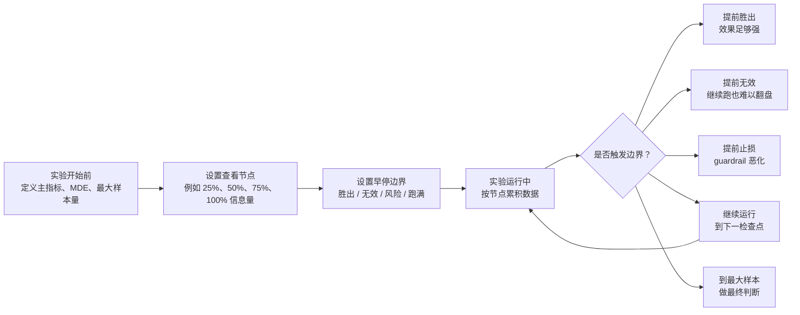
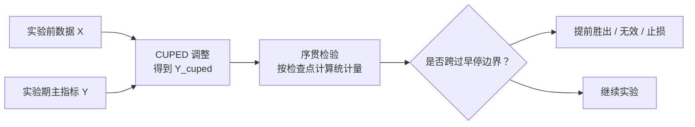

# 如何更快验证 A/B 实验效果（二）：序贯检验理论与应用介绍

> 最后更新：2026-06-24

## 一、概览

序贯检验（Sequential Testing）是一类允许实验在运行过程中多次查看结果，并在证据足够时提前停止的统计方法。

在传统 A/B 实验里，通常要求：

```text
实验前确定样本量或实验周期
实验跑满后只看一次结果
根据这一次结果判断是否显著
```

但真实业务中，团队经常会每天看实验面板：如果 p 值已经显著，就想提前上线；如果明显没效果，就想提前停止；如果 guardrail 指标恶化，也希望及时止损。

问题在于，普通固定样本检验不支持这种“边跑边看、看到显著就停”的用法。序贯检验解决的就是这个问题：它把“中途查看”和“提前停止”纳入实验设计，让我们可以在控制误判率的前提下更灵活地做决策。

可以先用一张图理解序贯检验在做什么：



一句话概括：

```text
序贯检验不是让你随便偷看数据，而是提前规定怎么合法地看、什么时候可以停、停下来后结论是否仍然可信。
```

## 二、序贯检验解决什么问题

### 1. 普通 p 值为什么不能每天看

传统固定样本检验控制的是：

$$
\Pr_{H_0}(p_N \le \alpha) \le \alpha
$$

这里的 $N$ 是实验前确定好的最终样本量。含义是：如果真实没有效果，在跑满 $N$ 后只看一次结果，错误地判断“显著”的概率不超过 $\alpha$，例如 5%。

但如果我们每天都看一次普通 p 值，并且采用：

```text
只要某一天 p < 0.05，就宣布实验显著并停止
```

实际控制的就不再是 $p_N$，而是：

$$
\Pr_{H_0}(\exists t \le T: p_t \le \alpha)
$$

这个概率通常会大于 $\alpha$。直观上，每多看一次，就多了一次被随机波动骗到的机会。

如果粗略把多次查看近似成相互独立，那么看 $K$ 次时，至少一次误判的概率约为：

$$
1 - (1-\alpha)^K
$$

例如 $\alpha = 0.05$，看 10 次时：

$$
1 - 0.95^{10} \approx 40.1\%
$$

真实实验中的多次查看结果并不独立，所以这个数不是精确结论，但它能说明方向：反复看普通 p 值，会显著增加假阳性风险。

### 2. “偷看问题”到底错在哪里

偷看问题（peeking problem）不是“看数据”本身有错，而是：

```text
用固定样本检验的方法，却按动态样本量的方式做决策。
```

也就是说，原本的统计保证建立在“只看一次”的条件上；一旦实验者根据中途结果决定提前停止，样本量就变成了数据驱动的，原来的 p 值和置信区间不再有原本宣称的错误率保证。

对业务团队来说，这会带来两个风险：

1. 把随机波动误判为真实收益，提前上线无效甚至有害的方案。
2. 在实验平台里形成“显著就停、不显著就继续跑”的偏差，长期积累会高估实验收益。

### 3. 序贯检验的核心目标

序贯检验不是反对中途查看，而是把中途查看变成实验设计的一部分。

它通常要同时回答四个问题：

| 问题 | 含义 |
| --- | --- |
| 什么时候看 | 每天看、每 2 天看，还是在 25% / 50% / 75% / 100% 信息量时看 |
| 看什么指标 | 主指标、guardrail 指标、分层指标是否都参与早停 |
| 看到什么程度可以停 | 需要跨过怎样的统计边界 |
| 停下来后如何解释 | 提前胜出、提前无效、风险止损还是跑满后无显著 |

## 三、序贯检验思想

可以把序贯检验讲成一句话：

```text
传统实验像期末考试，只能最后判卷；序贯检验像阶段测验，允许中途判断，但每次判断标准都要提前设计好。
```

举个例子。假设我们测试一个新功能是否能提升付费率。原计划跑 14 天。

普通固定样本检验的规则是：

```text
14 天后统一看结果。
```

但产品同学第 3 天、第 5 天、第 7 天都想看。如果第 5 天正好显著，就想上线；如果第 7 天不显著，又想继续跑。这样做的问题是，实验结论会被短期随机波动影响。

序贯检验会说：

```text
可以中途看，但第 5 天不能按普通 p < 0.05 就停。
早期想停，需要更强的证据。
越接近实验末尾，停止门槛可以逐渐接近普通检验。
```

这就像比赛中提前判定胜负。如果刚开局就想宣布胜利，需要领先非常多；如果比赛快结束了，领先一点也更有说服力。

所以序贯检验的思想可以用三个关键词概括：

| 关键词 | 含义 | 直白解释 |
| --- | --- | --- |
| 中途查看 | 实验还没跑满时查看累计数据 | 可以看，但要按规则看 |
| 早停边界 | 判断是否提前停止的统计阈值 | 早期停需要更强证据 |
| 错误率控制 | 多次查看后仍控制误判概率 | 不因为看很多次就更容易误判 |

## 四、核心理论

### 1. 固定样本检验与序贯检验的区别

固定样本检验的决策规则是：

$$
\text{在固定样本量 } N \text{ 时，如果 } Z_N > z_{\alpha} \text{，则拒绝 } H_0
$$

其中 $Z_N$ 是最终样本量下的标准化检验统计量。

序贯检验的决策规则是：

$$
\text{如果存在某个检查点 } k \text{，使得 } Z_k > b_k \text{，则提前拒绝 } H_0
$$

其中 $b_k$ 是第 $k$ 次查看时的边界。序贯检验的重点就在于如何设置这些 $b_k$，使得整体假阳性率仍然不超过 $\alpha$：

$$
\Pr_{H_0}(\exists k: Z_k > b_k) \le \alpha
$$

### 2. 信息量与检查点

序贯检验通常不用“第几天”作为理论单位，而是用信息量（information）来描述实验进度。

如果最终计划信息量是 $I_K$，第 $k$ 次查看时的信息量是 $I_k$，则信息比例为：

$$
t_k = \frac{I_k}{I_K}
$$

在用户级均值差实验中，信息量可以近似理解为有效样本量；在转化率、收入、留存等指标中，也可以根据标准误或方差估计来计算。

常见检查点可以设为：

```text
25% 信息量
50% 信息量
75% 信息量
100% 信息量
```

也可以按业务节奏设置，例如每天、每两天或每周。但查看越频繁，边界设计越重要。

### 3. Alpha spending：把错误率分批花掉

一个直观理解是：整个实验只有 $\alpha = 0.05$ 的一类错误预算。固定样本检验是在最后一次性花掉这 5%；序贯检验则是在多个检查点分批花掉。

设 $\alpha(t)$ 是到信息比例 $t$ 时累计花掉的一类错误预算，则：

$$
\alpha(0) = 0,\quad \alpha(1)=\alpha
$$

第 $k$ 次检查时，边界 $b_k$ 的选择要满足：

$$
\Pr_{H_0}(\exists j \le k: Z_j > b_j) = \alpha(t_k)
$$

这类方法被称为 alpha spending。它的好处是检查点不一定必须完全固定；只要能计算当前信息量，就可以根据累计信息量分配错误率预算。

### 4. 常见边界类型

| 方法 | 特点 | 适合场景 |
| --- | --- | --- |
| Pocock 边界 | 每次检查的阈值相对接近，早期也有一定机会停止 | 希望较均衡地在各阶段发现效果 |
| O’Brien-Fleming 边界 | 早期阈值很高，后期接近固定样本检验 | 不希望实验太早因偶然波动停止 |
| Lan-DeMets alpha spending | 用函数动态分配 alpha，可近似 Pocock 或 O’Brien-Fleming | 检查点不完全固定、平台化实现 |
| mSPRT / always-valid p-value | 支持更连续地查看结果 | 在线 A/B 平台、频繁监控实验 |
| Bayesian sequential | 用后验概率和决策损失早停 | 决策偏业务风险而非严格频率学 alpha |

产品 A/B 实验中，如果团队刚开始落地，推荐先使用 group sequential + alpha spending。它更容易解释，也更接近传统实验报告体系。

## 五、Always-valid inference 与 mSPRT

在互联网 A/B 实验里，很多实验平台希望结果面板随时可看，而不是只允许固定几个检查点。这时常见方案是 always-valid inference。

always-valid p-value 的目标是：

$$
\Pr_{H_0}(p_{\tau} \le \alpha) \le \alpha
$$

这里的 $\tau$ 可以是任意由数据决定的停止时间。也就是说，只要使用的是 always-valid p-value，用户在任意时间停止实验，都仍然能控制一类错误率。

mSPRT（mixture Sequential Probability Ratio Test）是一种常用于 A/B 测试场景的 always-valid 方法。它的核心思路是比较：

```text
数据在“没有效果”假设下有多可能
vs.
数据在“一系列可能效果大小”下有多可能
```

可以写成混合似然比：

$$
\Lambda_t = \int \frac{L_t(\delta)}{L_t(0)} \pi(\delta)d\delta
$$

其中：

- $L_t(0)$ 表示到时间 $t$ 为止，在零效果假设下的数据似然。
- $L_t(\delta)$ 表示在效果大小为 $\delta$ 时的数据似然。
- $\pi(\delta)$ 是对可能效果大小的混合分布。

当证据足够强时，似然比会跨过边界：

$$
\Lambda_t \ge \frac{1}{\alpha}
$$

此时可以拒绝零假设。它的优点是支持更频繁的查看，并且能保留类似 p 值的产品界面；缺点是理论和实现比固定检查点的 group sequential 更复杂，需要平台封装好。

## 六、序贯检验与 CUPED 的关系

两者解决的问题不同，但非常适合组合使用。

```text
CUPED 解决“指标噪声太大”的问题。
序贯检验解决“能不能中途看结果并提前停”的问题。
```

CUPED 用实验前数据降低指标方差，让实验效果估计更稳定。序贯检验则控制多次查看和提前停止带来的误判风险。

可以这样串起来：



推荐做法是：

```text
先预先定义 CUPED 指标
再对 CUPED 后的主指标应用序贯检验
```

这样做的效果是：

| 方法 | 作用 | 对实验周期的影响 |
| --- | --- | --- |
| CUPED | 降低方差，让每次查看时信号更清楚 | 更少样本也可能达到同样精度 |
| 序贯检验 | 允许在证据足够时提前停止 | 不必机械等到最大样本 |
| CUPED + 序贯检验 | 指标更稳定，且决策规则允许早停 | 更适合“更短时间评估实验效果” |

但要注意：CUPED 不能替代序贯检验。即使用了 CUPED，也不能每天查看普通 p 值并在显著时停止。CUPED 只降低方差，不会自动修正多次查看带来的假阳性膨胀。

## 七、适用场景

序贯检验特别适合以下实验：

| 场景 | 原因 |
| --- | --- |
| 流量成本高 | 无效实验可以提前停，释放流量 |
| 机会成本高 | 强正向实验可以更早上线 |
| 风险较高 | guardrail 变差时可以提前止损 |
| 实验周期长 | 不必等完整周期才做判断 |
| 实验平台化 | 可统一规范“中途看结果”的行为 |

不太适合或需要谨慎的场景：

| 场景 | 风险 |
| --- | --- |
| 指标成熟很慢 | 早期数据可能不能代表最终效果 |
| 强周期性业务 | 早停可能错过周末、节假日或活动周期 |
| 多指标、多分层很多 | 需要额外做多重检验控制 |
| 样本进入延迟或回传延迟大 | 当前统计量可能基于不完整数据 |
| 团队无法遵守预设规则 | 序贯设计会被人为选择性解释破坏 |

## 八、标准实施流程

### 1. 实验前设计

实验开始前应明确：

| 项目 | 说明 |
| --- | --- |
| 主指标 | 参与序贯检验的核心决策指标 |
| Guardrail 指标 | 触发风险止损的指标，例如崩溃率、投诉率、留存下降 |
| 最大样本量 / 最大周期 | 即使没有早停，也必须结束的上限 |
| 检查点 | 例如 25% / 50% / 75% / 100% 信息量 |
| 早停边界 | 胜出、无效、风险止损的判断规则 |
| 统计方法 | Pocock、O’Brien-Fleming、Lan-DeMets、mSPRT 或 Bayesian |
| 是否叠加 CUPED | 如果使用 CUPED，需预先固定协变量和窗口 |

### 2. 运行中监控

每个检查点需要输出：

| 字段 | 含义 |
| --- | --- |
| information_fraction | 当前信息比例 |
| n_control / n_treatment | 当前两组样本量 |
| effect | 当前效果估计 |
| standard_error | 标准误 |
| z_stat | 标准化统计量 |
| boundary_efficacy | 胜出边界 |
| boundary_futility | 无效边界 |
| decision | continue / stop_win / stop_futility / stop_guardrail / max_sample |

建议每次检查都记录快照，避免事后只保留最后一次结果，无法审计中间决策。

### 3. 早停决策

常见决策规则：

| 决策 | 触发条件 | 解释 |
| --- | --- | --- |
| 提前胜出 | 主指标跨过正向边界，guardrail 无明显风险 | 效果证据足够强 |
| 提前无效 | 达到 futility 边界，继续跑也很难达成目标 | 节省流量和时间 |
| 提前止损 | guardrail 明显恶化 | 即使主指标变好也不继续 |
| 继续运行 | 未跨过任何边界 | 等待下一检查点 |
| 跑满结束 | 到达最大样本量或最大周期 | 按最终边界判断 |

### 4. 实验报告

最终报告建议同时说明：

1. 使用的序贯检验方法。
2. 预设检查点和实际检查点。
3. 每次检查的信息比例、效果估计和边界。
4. 是否提前停止，以及触发了哪个边界。
5. 如果叠加 CUPED，说明 CUPED 协变量、窗口和方差缩减。
6. 主指标结论和 guardrail 结论。
7. 仍需观察的长期指标。

## 九、BigQuery 风格数据准备模板

序贯检验的 SQL 通常分成两层：

1. 构建用户级或实验单位级指标表。
2. 按检查点聚合，输出每个检查点的效果估计和标准误。

下面是一个简化模板，用于表达数据结构。实际边界计算通常放在 Python/R/实验平台中完成。

```sql
WITH assignment AS (
  SELECT
    user_id,
    variant,
    MIN(exposure_time) AS first_exposure_time
  FROM experiment_assignment
  WHERE experiment_id = 'exp_xxx'
    AND assignment_date BETWEEN '2026-06-01' AND '2026-06-14'
  GROUP BY user_id, variant
),

user_metric_by_day AS (
  SELECT
    a.user_id,
    a.variant,
    m.dt,
    SUM(m.metric_value) AS metric_value
  FROM assignment a
  JOIN user_daily_metric m
    ON a.user_id = m.user_id
   AND m.dt >= DATE(a.first_exposure_time)
   AND m.dt BETWEEN '2026-06-01' AND '2026-06-14'
  GROUP BY a.user_id, a.variant, m.dt
),

checkpoints AS (
  SELECT DATE '2026-06-04' AS checkpoint_date, 0.25 AS information_fraction UNION ALL
  SELECT DATE '2026-06-07' AS checkpoint_date, 0.50 AS information_fraction UNION ALL
  SELECT DATE '2026-06-10' AS checkpoint_date, 0.75 AS information_fraction UNION ALL
  SELECT DATE '2026-06-14' AS checkpoint_date, 1.00 AS information_fraction
),

unit_metric_at_checkpoint AS (
  SELECT
    c.checkpoint_date,
    c.information_fraction,
    u.user_id,
    u.variant,
    SUM(u.metric_value) AS y
  FROM checkpoints c
  JOIN user_metric_by_day u
    ON u.dt <= c.checkpoint_date
  GROUP BY c.checkpoint_date, c.information_fraction, u.user_id, u.variant
),

checkpoint_summary AS (
  SELECT
    checkpoint_date,
    information_fraction,
    variant,
    COUNT(*) AS users,
    AVG(y) AS mean_y,
    VAR_SAMP(y) AS var_y
  FROM unit_metric_at_checkpoint
  GROUP BY checkpoint_date, information_fraction, variant
)

SELECT *
FROM checkpoint_summary
ORDER BY checkpoint_date, variant;
```

如果要和 CUPED 结合，可以先在 `unit_metric_at_checkpoint` 之前生成用户级 `y_cuped`，再对 `y_cuped` 做同样的检查点聚合。

## 十、常见风险和误区

### 1. 把每天看普通 p 值当成序贯检验

这是最常见误区。序贯检验不是“每天计算一次 p 值”，而是必须使用能控制多次查看错误率的边界、alpha spending 或 always-valid 方法。

### 2. 实验后才决定检查点

检查点、边界和最大样本量应在实验前确定。实验后根据结果选择“看哪一天”或“用哪个边界”，会重新引入选择偏差。

### 3. 只设置胜出早停，不设置无效和止损

如果只在显著时提前停，不显著就继续跑，会形成偏向正向结果的决策机制。更完整的设计应同时考虑 futility 和 guardrail。

### 4. 忽略指标成熟期

很多指标不是实验开始后立刻成熟。比如 D7 留存、订阅续费、长期 LTV。如果过早使用未成熟指标早停，可能误判长期效果。

### 5. 多指标、多分层没有控制错误率

如果同时看多个主指标、多个国家、多个平台、多个版本，序贯检验只解决“时间维度上的多次查看”，不自动解决所有横向多重比较问题。需要结合 FDR、Bonferroni、层级指标策略或明确的主指标优先级。

### 6. 把 Bayesian sequential 和 frequentist alpha 混在一起解释

Bayesian 方法可以自然地连续更新后验概率，但它控制的是后验风险，不一定等价于频率学的一类错误率。报告时要说明决策口径，避免把“后验胜率 95%”解释成“p = 0.05”。

## 十一、与其他提效方法的关系

| 方法 | 作用 | 与序贯检验的关系 |
| --- | --- | --- |
| CUPED | 降低指标方差 | 可先做 CUPED，再对调整后指标做序贯检验 |
| 分层随机 | 提高分组平衡性 | 可减少早期随机不平衡 |
| 触发分析 | 聚焦真正受实验影响的人群 | 可提高每个检查点的信息质量 |
| 指标线性化 | 处理比率指标 | 可在线性化指标上做序贯检验 |
| Guardrail 监控 | 控制风险 | 常作为序贯止损规则 |
| Bayesian 实验 | 用后验概率和损失函数决策 | 是另一类序贯决策框架 |

如果目标是“更短时间评估实验效果”，推荐组合是：

```text
CUPED 降低方差
+ 序贯检验合法早停
+ 触发分析聚焦受影响人群
+ guardrail 指标防止局部优化
```

## 十二、推荐落地方案

### 1. 第一阶段：离线模拟

目标：验证序贯检验在历史实验上的收益和错误率。

工作项：

1. 选择历史 A/A 和历史 A/B 实验。
2. 模拟不同检查点：每天、每 2 天、25% / 50% / 75% / 100%。
3. 比较 Pocock、O’Brien-Fleming、Lan-DeMets 等边界。
4. 评估 false positive rate、平均停止时间、power、提前胜出比例、提前无效比例。
5. 选择一套默认策略。

验收标准：

- A/A 实验中的 false positive rate 接近目标水平。
- 历史正向实验能更早发现明显效果。
- 历史无效实验能节省一定流量。

### 2. 第二阶段：实验报告接入

目标：让序贯检验成为实验分析可选能力。

工作项：

1. 在实验配置中增加 `sequential_enabled`。
2. 支持配置最大样本量、检查点、边界类型。
3. 每个检查点输出统计量、边界和决策建议。
4. 报告中展示检查点轨迹。
5. 如果结合 CUPED，同时展示 raw 与 CUPED 后的序贯结果。

### 3. 第三阶段：平台化治理

目标：规范团队中途查看实验的行为。

能力清单：

- 固定样本检验与序贯检验明确区分。
- 启用序贯检验的实验才允许基于中途结果早停。
- 早停记录可审计。
- 支持 guardrail 止损。
- 支持多指标错误率控制。
- 提供“继续跑 / 提前胜出 / 提前无效 / 提前止损”的标准解释。

## 十三、实验报告中的推荐表述

可以使用如下模板：

```text
本实验主指标使用序贯检验进行分析，最大样本量为每组 100,000 用户，预设检查点为 25%、50%、75%、100% 信息量。

本次采用 O’Brien-Fleming 风格边界，早期停止需要更强证据，以控制整体一类错误率在 5%。

实验在第 3 个检查点达到 75% 信息量时，主指标跨过正向早停边界，触发提前胜出。当前主指标相对提升 2.1%，序贯检验结论为显著正向。

Guardrail 指标未触发风险边界。若使用 CUPED，本次 CUPED 后方差降低 28%，序贯检验基于 CUPED 后主指标进行。

由于部分长期指标尚未完全成熟，建议上线后继续观察 D7 留存和长期收入。
```

## 十四、决策建议

如果团队当前还没有序贯检验，建议按以下优先级推进：

1. 先明确哪些实验允许中途早停，哪些必须固定样本跑满。
2. 从 group sequential + O’Brien-Fleming 或 Lan-DeMets alpha spending 开始，避免一开始实现过复杂。
3. 主指标先支持序贯检验，guardrail 先支持止损规则。
4. 与 CUPED 结合时，必须在实验前固定 CUPED 口径。
5. 用历史 A/A 实验校准 false positive rate，再进入正式实验报告。
6. 在实验平台中明确提示：未启用序贯检验时，中途普通 p 值只作观察，不能作为提前上线依据。

最重要的治理原则是：序贯检验应是预先定义的实验设计，而不是实验跑到一半后临时选择的解释方式。

## 十五、参考资料

- Ramesh Johari, Leo Pekelis, David J. Walsh. “Always Valid Inference: Bringing Sequential Analysis to A/B Testing.” arXiv, 2015. https://arxiv.org/abs/1512.04922
- Ramesh Johari, Pete Koomen, Leonid Pekelis, David Walsh. “Peeking at A/B Tests: Why it matters, and what to do about it.” KDD 2017. https://dl.acm.org/doi/10.1145/3097983.3097992
- Stuart J. Pocock. “Group sequential methods in the design and analysis of clinical trials.” Biometrika, 1977. https://academic.oup.com/biomet/article/64/2/191/384776
- Peter C. O’Brien, Thomas R. Fleming. “A multiple testing procedure for clinical trials.” Biometrics, 1979. https://pubmed.ncbi.nlm.nih.gov/497341/
- David L. DeMets, K. K. Gordon Lan. “Interim analysis: The alpha spending function approach.” Statistics in Medicine, 1994. https://pubmed.ncbi.nlm.nih.gov/7973215/
- Optimizely. “The story behind Optimizely’s new Stats Engine.” https://www.optimizely.com/insights/blog/statistics-for-the-internet-age-the-story-behind-optimizelys-new-stats-engine/

