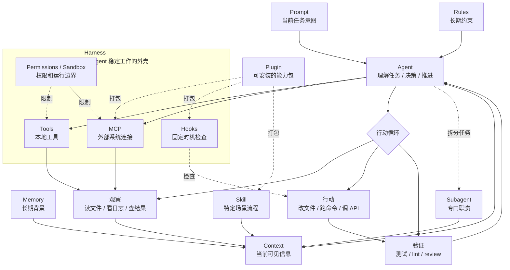

# Agent 常用概念：从“会聊天”到“能干活”

理解 Agent 相关概念时，最容易卡住的地方不是名词本身，而是这些名词之间的边界。Agent、Skill、Plugin、MCP、Hook、Memory、Harness，一层又一层，看起来都很重要，但真正开始动手时，反而容易不知道每个东西应该放在哪。

Agent 也很容易被理解成“更聪明的模型”。这个理解不算错，但不完整。模型当然重要，但 Agent 真正能做事，靠的不是模型自己突然长出了手脚，而是模型外面那一整套环境：它能读什么、能写什么、能调用什么工具、遇到危险操作时谁来拦、做完以后怎么验证。

所以可以先用一个比较朴素的定义理解它：

> Agent 不是一个模型，而是一个能循环感知、决策、行动、验证的工作系统。

Claude Code 这类工具有意思的地方就在这里。它不是单纯提供一个聊天框，而是把模型放进了一个工程环境里。模型负责判断下一步做什么，外层系统负责提供工具、上下文、权限和反馈。Harness 概念的核心也在这个方向：不要只想着“怎么让模型更聪明”，还要设计一套能把模型能力稳定释放出来的外壳。

下面这张图可以先作为整体关系的入口。Agent 是中间的决策循环，Harness 是外层运行环境，Rules、Memory、Skill 主要影响上下文和流程，Tools、MCP、Hook、Permissions 则决定它能怎么行动、怎么被约束。

## Agent

Agent 可以先理解成“会自己推进任务的助手”。

普通聊天更像一次问答：用户问一句，模型答一句。Agent 则会多一个循环：先理解任务，再收集上下文，然后调用工具行动，拿到结果后继续判断下一步，直到它认为任务完成。

比如让一个 coding agent 修一个测试失败的问题，它不会只回答“可能是某某文件有问题”。它会先搜代码，读文件，运行测试，修改代码，再重新跑测试。这个过程里，模型一直在做判断，但真正改变环境的是工具。

所以 Agent 的关键不是“它像不像人”，而是它有没有完成闭环：

- 能不能看到环境里的信息。
- 能不能采取行动。
- 能不能根据行动结果继续修正。
- 能不能在结束前做验证。

没有工具和反馈，模型只是会说；有了这套循环，才开始像是在工作。

## Harness

Harness 这个词可以翻译成“驾驭层”或者“运行外壳”。它比“框架”更贴近 Agent 系统的实际状态，因为它强调的不是把模型包起来，而是给模型加上缰绳、仪表盘和护栏。

在 Agent 系统里，Harness 通常包含这些东西：

- 工具：文件读写、命令行、浏览器、数据库、API。
- 知识：项目说明、代码规范、业务文档、历史决策。
- 观察：日志、测试结果、diff、页面截图、报错信息。
- 权限：哪些操作可以直接做，哪些必须等人确认。
- 反馈：测试、lint、dry run、review、监控。

这也是为什么构建 Agent 时，不能只盯着 prompt。Prompt 当然重要，但 prompt 更像“交代任务”；Harness 才决定这个助手能不能在真实环境里可靠地干活。

一个不太严谨但好用的判断是：如果问题是“希望它知道什么”，通常是上下文或规则；如果问题是“希望它能做什么”，通常是工具或 MCP；如果问题是“希望它每次都按这个流程做”，通常是 Skill；如果问题是“不允许它越过某条线”，通常是权限、Hook 或沙箱。

## Rules

Rules 是常驻规则，适合放那些“每次都应该遵守”的约束。

比如一个项目里可能会写：

- 不要改某些目录。
- 新增功能必须补测试。
- 写 SQL 前先 dry run。
- 用户确认和授权时必须用中文。
- 私人内容只保存在本地，不要进入公开仓库。

Rules 的价值在于稳定。它让 Agent 不用每次都靠临时提醒，就能知道这个项目的边界和习惯。

但 Rules 也有一个问题：它会变成常驻上下文。写得越长，越容易变成背景噪音。真正适合 Rules 的东西，应该是短、硬、长期有效的约束。那些很长的流程、案例、模板，其实不适合一直塞在规则里。

更适合把 Rules 当成“底线”和“项目习惯”，而不是万能说明书。

## Prompt

Prompt 是当前任务中想让 Agent 做什么。

它可以很短，比如“修这个 bug”；也可以很具体，比如“只改 SQL，不要动文档，输出可直接复制执行的 BigQuery 脚本”。Prompt 的作用是给当前任务定方向。

Prompt 和 Rules 的区别在于：Prompt 是本次任务的意图，Rules 是长期存在的约束。

如果一个要求只对这次有效，放在 Prompt 里就好。如果某件事每次都需要重复提醒，那它可能应该沉淀成 Rules 或 Skill。

## Tools

Tools 是 Agent 的手。

模型自己不能真的读文件、跑测试、打开网页、查数据库。它只能决定“需要调用什么工具”。真正执行动作的是工具系统。

常见工具可以分为几类：

- 读：读取文件、搜索代码、打开网页、查看数据库结构。
- 写：修改文件、生成文档、创建 issue、写入表格。
- 执行：运行测试、启动服务、调用命令行、跑脚本。
- 连接：访问 GitHub、Notion、Slack、BigQuery、浏览器等外部系统。

工具设计得好，Agent 的行动就清楚；工具设计得太碎，它会在选择上浪费很多判断；工具设计得太宽，又容易出现误操作。

比较理想的工具不是越多越好，而是让 Agent 有几种可靠的基础能力，再用规则和权限限制边界。对 coding agent 来说，读文件、搜代码、改文件、跑命令这几类能力就已经很强了。

## Context

Context 是 Agent 当前能看到的信息。

它不等于“模型知道的一切”。模型可能训练时见过很多知识，但在一次具体任务里，它真正能稳定使用的，是当前上下文里提供给它的东西：当前需求、历史对话、项目文件、工具返回结果、规则、Skill 描述等。

很多 Agent 问题，本质上不是模型不会，而是上下文没给对。比如让它改一个复杂项目，如果它没有读到项目结构、没有看到相关文件、没有测试反馈，就很容易凭感觉写代码。

Context 的难点是取舍。给少了，它看不清；给多了，它会被淹没。长日志、大文件、无关文档都会挤占空间。所以好的 Agent 工作流，通常会很重视“先搜，再读关键部分”，而不是一上来把所有东西都塞进去。

## Memory

Memory 是跨会话保留下来的上下文。

它适合记录长期稳定的信息，比如个人偏好、项目约定、踩过的坑、某个目录的用途。它不适合记录一大段临时聊天，也不适合把所有历史都塞进去。

Memory 更适合像一本薄薄的工作笔记，而不是完整录像。

好的 Memory 会让 Agent 少问重复问题。比如它记得“这个博客里的月度日记是本地私有内容，不应该发布到站点”，下一次处理博客时就不容易踩线。

但 Memory 也需要克制。过时的信息如果一直留着，反而会误导 Agent。所以 Memory 更适合放低频变化的事实，而不是每天都在变的状态。

## Skill

Skill 可以理解成“可复用的工作手册”。

如果某一套流程经常被重复复制给 Agent，比如“怎么写一篇数据分析文档”“怎么处理一个 PR review”“怎么生成一份 PPT”，那这套流程就很适合沉淀成 Skill。

一个 Skill 通常会包含：

- 什么时候应该使用它。
- 执行这个任务的步骤。
- 需要注意的边界。
- 示例、模板或脚本。

Skill 和 Rules 的区别很重要。Rules 是每次都要遵守的底线，Skill 是特定场景下才加载的流程。把长流程写进 Rules，会污染所有任务的上下文；写成 Skill，就只有相关任务触发时才读。

这也是 Skill 很实用的地方：它让经验可以被沉淀，但不必每次都挤进主上下文。

## Plugin

Plugin 比 Skill 更像一个完整工具包。

一个 Plugin 可以打包很多东西：Skill、Agent、命令、Hook、MCP 连接、配置文件。它解决的问题不是“这个流程怎么做”，而是“如何把一整套能力安装到某个环境里”。

比如一个数据分析 Plugin 可能包含：

- 写 SQL 的 Skill。
- 查询 BigQuery 的 MCP 工具。
- 做 dry run 的 Hook。
- 一个专门检查指标口径的子 Agent。
- 几个常用命令。

所以可以简单区分一下：

- Skill 是一份工作手册。
- Plugin 是一整套可安装、可分享的能力包。

单人使用时，Skill 往往已经够了。团队协作时，Plugin 的价值会变大，因为它可以把一组约定和工具一起分发出去，减少“成员本地配置都不一样”的问题。

## MCP

MCP 可以理解成 Agent 连接外部世界的一种标准接口。

Agent 想查数据库、读 Notion、看 GitHub PR、操作浏览器、调用内部系统，都需要某种连接方式。如果每个工具都写一套私有协议，生态会很难复用。MCP 做的事情，就是把这些外部能力包装成 Agent 可以发现和调用的工具。

对使用者来说，MCP 的直观价值是：Agent 不只是读本地文件，还能进入真实工作的系统。

但这也意味着风险变大了。能读数据库，就要考虑权限；能发消息，就要考虑误发；能改 issue，就要考虑审计。所以 MCP 往往要和权限、沙箱、只读模式一起设计。

## Hook

Hook 是固定时机触发的检查或动作。

如果说 Rules 是告诉 Agent “应该怎么做”，Hook 更像是在关键节点放一个自动闸门。

比如：

- 在执行 shell 命令前，检查是不是危险命令。
- 在修改文件后，自动跑 formatter。
- 在提交前，自动跑测试。
- 在 Agent 结束前，检查是否还有未完成的 todo。

Hook 的好处是确定性更强。模型可能忘记某条提醒，但 Hook 到点就会执行。凡是“必须发生”的检查，尽量不要只靠自然语言提醒。

当然 Hook 也不应该滥用。太多 Hook 会让系统变得难调试。适合写 Hook 的，通常是安全、质量、审计这类硬要求。

## Subagent

Subagent 是一个带专门职责的子助手。

它通常有自己的上下文、自己的规则、自己的工具范围。主 Agent 可以把一部分任务交给它，然后只拿回结果摘要。

这在长任务里很有用。比如主 Agent 正在改代码，可以让一个 Subagent 去读某个模块的历史设计，让另一个 Subagent 去检查测试失败原因。这样主对话不会被大量搜索结果和日志塞满。

但 Subagent 不是“召唤一个更聪明的模型”。它更像任务拆分和上下文隔离工具。适合交给 Subagent 的任务，应该是边界清楚、可以独立完成、最后能汇总成结论的事情。

如果任务本身还很模糊，或者主 Agent 下一步马上依赖这个结果，那拆出去反而可能变慢。

## Permissions 和 Sandbox

Permissions 是权限规则，Sandbox 是运行边界。

Agent 能行动以后，安全问题就出现了。读文件还好，写文件、删文件、跑命令、访问外部服务，都可能产生真实后果。

所以一个可靠的 Agent 系统，一定要回答几个问题：

- 哪些操作可以自动执行？
- 哪些操作必须先问人？
- 哪些操作永远不允许？
- 如果执行错了，影响范围被限制在哪里？

Sandbox 的意义是把影响范围关起来。比如只允许写当前项目目录，不允许动系统目录；只允许读某些数据源，不允许写回生产表；只允许创建草稿，不允许直接发布。

这部分看起来不如“智能”酷，但它决定了 Agent 能不能真正投入日常工作。没有边界的自动化，不是效率工具，而是风险源。

## Command

Command 是用户主动触发的快捷操作。

比如 `/commit`、`/review`、`/compact` 这类命令，本质上是把一段常用流程做成一个入口。和 Skill 不同，Command 通常更偏“现在明确要执行这个动作”。

可以这样理解：

- Skill 偏自动触发，Agent 判断什么时候该用。
- Command 偏手动触发，用户明确告诉系统现在要做什么。

有些场景两者会重叠。比如“生成提交信息”既可以做成 Skill，也可以做成 `/commit-message` 命令。区别不在能力，而在交互方式。

## 这些概念怎么分层

从零开始构建一个 Agent 工作环境时，可以按下面的顺序分层：

第一层，先写 Rules。把长期不变的项目习惯和安全边界写清楚，越短越好。

第二层，整理 Tools。让 Agent 至少能读、搜、改、跑验证。没有工具，Agent 只能停留在建议层。

第三层，把重复流程沉淀成 Skill。不要每次复制同一段操作手册，也不要把长流程塞进 Rules。

第四层，接入必要的 MCP。只有当任务真的需要外部系统时再接，不要为了“看起来强大”把所有服务都连上。

第五层，对高风险动作加 Permissions、Sandbox 和 Hook。尤其是写数据库、发消息、删文件、部署发布这些动作，一定要有硬边界。

第六层，需要团队复用时，再考虑 Plugin。单人使用阶段不一定要过早做插件，先把 Skill 和规则跑顺更重要。

第七层，长任务再拆 Subagent。能不拆就不拆，拆的时候要给它清楚的职责和交付物。

## 最后

理解 Agent，其实是在理解一种新的工程分工。

过去写程序，是人把步骤拆清楚，再交给机器确定性执行。现在 Agent 让模型参与了“下一步做什么”的判断，但这不代表工程消失了。相反，工程的重点往外移了：从写死每一步，变成设计环境、约束、反馈和恢复机制。

也就是说，Agent 做得好不好，不只取决于模型有多强，还取决于是否给它一个适合工作的世界。

这也是 Harness 这个词真正有启发的地方。重要的不是让模型自由狂奔，而是让它在合适的范围里跑起来，跑错了能停，跑完了能验，下一次还能跑得更稳。

## 参考资料

- [从 Claude Code 看 Harness Engineer 的设计 - 初级程序员的文章 - 知乎](https://zhuanlan.zhihu.com/p/2021603278606087058)
- [How Claude Code works - Claude Code Docs](https://code.claude.com/docs/en/how-claude-code-works)
- [Extend Claude Code - Claude Code Docs](https://code.claude.com/docs/en/features-overview)
- [Extend Claude with skills - Claude Code Docs](https://code.claude.com/docs/en/skills)
- [Connect Claude Code to tools via MCP - Claude Code Docs](https://code.claude.com/docs/en/mcp)
- [Hooks reference - Claude Code Docs](https://code.claude.com/docs/en/hooks)
- [Create custom subagents - Claude Code Docs](https://code.claude.com/docs/en/sub-agents)
- [Create plugins - Claude Code Docs](https://code.claude.com/docs/en/plugins)
